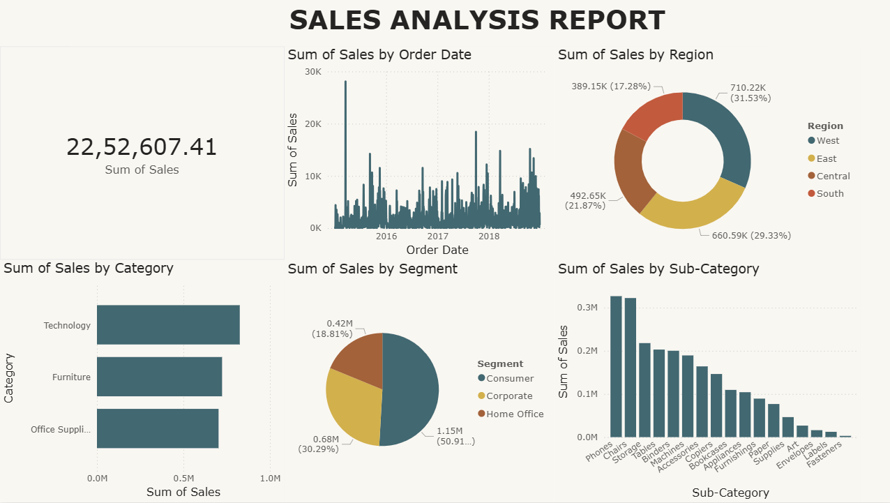

# Sales Dashboard Project

## Overview
End-to-end data analysis project on retail sales data, covering data cleaning, SQL analysis, and interactive dashboard creation.

## Tools & Technologies
- Python (Pandas, NumPy)
- SQL (MySQL)
- Excel (Pivot Tables, Charts)
- Power BI

## Tasks Achieved
- Cleaned and transformed raw sales data using Python (handled missing values, date formatting, and duplicates)
- Performed exploratory data analysis (EDA) to identify trends and patterns
- Wrote SQL queries to extract business insights (revenue by category, region, and time)
- Built Excel pivot reports for quick analysis
- Developed an interactive Power BI dashboard with multiple visualizations

## Key Insights
- Technology category generated the highest revenue
- Sales show consistent variation across months with identifiable trends
- Regional performance highlights key contributing markets
- Sub-category analysis reveals top-performing product segments

## Dashboard Preview

